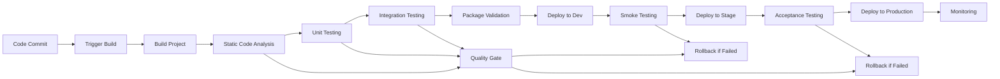

# CI/CD Pipeline

This document provides a comprehensive overview of the Continuous Integration and Deployment pipeline for the Voltrux Motors project. The pipeline automates the build, test, and deployment processes to ensure consistent, reliable, and efficient delivery of code changes.

## Overview

The Voltrux Motors CI/CD pipeline follows DevOps best practices to ensure that code changes are automatically built, tested, and deployed to different environments. The pipeline includes multiple stages: build, static analysis, unit testing, integration testing, package validation, and deployment.

## Pipeline Architecture

### High-Level Architecture


### Pipeline Stages

#### 1. Build Stage
- Compile Java source code
- Run Maven build process
- Create AEM packages
- Execute frontend build (Webpack, etc.)

#### 2. Static Analysis Stage
- Code quality analysis (SonarQube)
- Security vulnerability scanning
- Code style checks
- Dependency vulnerability scanning

#### 3. Testing Stage
- Unit tests execution
- Integration tests execution
- Component tests execution
- Code coverage analysis

#### 4. Packaging Stage
- Create deployment packages
- Validate package contents
- Generate package metadata
- Archive packages for deployment

#### 5. Deployment Stages
- Deploy to development environment
- Deploy to staging environment
- Deploy to production environment
- Run post-deployment tests

## GitHub Actions Pipeline

### Main Pipeline Configuration
```yaml
# .github/workflows/ci-cd-pipeline.yml
name: Voltrux Motors CI/CD Pipeline

on:
  push:
    branches: [ main, develop, release/* ]
  pull_request:
    branches: [ main ]

env:
  JAVA_VERSION: '11'
  MAVEN_VERSION: '3.8.6'
  NODE_VERSION: '18'

jobs:
  build-and-test:
    runs-on: ubuntu-latest
    steps:
      - name: Checkout code
        uses: actions/checkout@v3
        with:
          fetch-depth: 0

      - name: Set up JDK
        uses: actions/setup-java@v3
        with:
          java-version: ${{ env.JAVA_VERSION }}
          distribution: 'temurin'
          cache: 'maven'

      - name: Set up Node.js
        uses: actions/setup-node@v3
        with:
          node-version: ${{ env.NODE_VERSION }}
          cache: 'npm'

      - name: Cache Maven dependencies
        uses: actions/cache@v3
        with:
          path: ~/.m2
          key: ${{ runner.os }}-m2-${{ hashFiles('**/pom.xml') }}

      - name: Cache Node modules
        uses: actions/cache@v3
        with:
          path: ~/.npm
          key: ${{ runner.os }}-node-${{ hashFiles('**/package-lock.json') }}

      - name: Install dependencies
        run: npm ci

      - name: Run Maven verify
        run: mvn -B verify -PautoInstallPackage
        env:
          MAVEN_OPTS: -Xmx2g -Xms512m

      - name: Run frontend build
        run: npm run build

      - name: Run tests
        run: |
          npm run test
          mvn test

      - name: Publish test results
        uses: dorny/test-reporter@v1
        if: success() || failure()
        with:
          name: Maven Tests
          path: core/target/surefire-reports/*.xml
          reporter: java-junit

      - name: SonarQube Scan
        run: mvn sonar:sonar
          -Dsonar.projectKey=voltrux-motors
          -Dsonar.organization=voltrux
          -Dsonar.host.url=https://sonarcloud.io
          -Dsonar.token=${{ secrets.SONAR_TOKEN }}
        if: github.event_name == 'push' && github.ref == 'refs/heads/main'

      - name: Archive artifacts
        uses: actions/upload-artifact@v3
        with:
          name: aem-packages
          path: |
            all/target/*.zip
            ui.apps/target/*.zip
          retention-days: 7
```

### Deployment Pipeline Configuration
```yaml
# .github/workflows/deploy.yml
name: Deployment Pipeline

on:
  workflow_run:
    workflows: ["Voltrux Motors CI/CD Pipeline"]
    types: [completed]
    branches: [main]

jobs:
  deploy-dev:
    runs-on: ubuntu-latest
    if: ${{ github.event.workflow_run.conclusion == 'success' }}
    environment: development
    steps:
      - name: Download artifacts
        uses: actions/download-artifact@v3
        with:
          name: aem-packages
          path: ./packages

      - name: Deploy to Dev
        run: |
          curl -u ${{ secrets.DEV_USER }}:${{ secrets.DEV_PASSWORD }} \
            -F "file=@./packages/*.zip" \
            -F "install=true" \
            http://dev.voltrux-motors.com:4503/crx/packmgr/service.jsp

      - name: Run smoke tests
        run: |
          npm install @cypress-io/github-action
          npx cypress run --config-file cypress.dev.json

  deploy-stage:
    runs-on: ubuntu-latest
    if: ${{ needs.deploy-dev.result == 'success' }}
    environment: staging
    needs: deploy-dev
    steps:
      - name: Download artifacts
        uses: actions/download-artifact@v3
        with:
          name: aem-packages
          path: ./packages

      - name: Deploy to Staging
        run: |
          curl -u ${{ secrets.STAGE_USER }}:${{ secrets.STAGE_PASSWORD }} \
            -F "file=@./packages/*.zip" \
            -F "install=true" \
            http://stage.voltrux-motors.com:4503/crx/packmgr/service.jsp

      - name: Run acceptance tests
        run: |
          npx cypress run --config-file cypress.stage.json

  deploy-prod:
    runs-on: ubuntu-latest
    if: ${{ needs.deploy-stage.result == 'success' && github.event_name == 'release' }}
    environment: production
    needs: deploy-stage
    steps:
      - name: Download artifacts
        uses: actions/download-artifact@v3
        with:
          name: aem-packages
          path: ./packages

      - name: Deploy to Production
        run: |
          curl -u ${{ secrets.PROD_USER }}:${{ secrets.PROD_PASSWORD }} \
            -F "file=@./packages/*.zip" \
            -F "install=true" \
            http://voltrux-motors.com:4503/crx/packmgr/service.jsp

      - name: Run production tests
        run: |
          npx cypress run --config-file cypress.prod.json

      - name: Create release
        id: create_release
        uses: actions/create-release@v1
        env:
          GITHUB_TOKEN: ${{ secrets.GITHUB_TOKEN }}
        with:
          tag_name: ${{ github.ref }}
          release_name: Release ${{ github.ref }}
          body: |
            Release for ${{ github.ref }}
            Commit: ${{ github.sha }}
          draft: false
          prerelease: false
```

## Jenkins Pipeline

For teams using Jenkins, here's an example pipeline configuration:

```groovy
// Jenkinsfile
pipeline {
    agent any

    environment {
        JAVA_HOME = "${env.JAVA_HOME_11_X64}"
        MAVEN_OPTS = "-Xmx2g -Xms512m"
        AEM_AUTHOR_URL = "http://author.voltrux-motors.com:4502"
        AEM_PUBLISH_URL = "http://publish.voltrux-motors.com:4503"
    }

    stages {
        stage('Checkout') {
            steps {
                checkout scm
            }
        }

        stage('Validate') {
            steps {
                sh 'mvn clean validate'
            }
        }

        stage('Compile') {
            steps {
                sh 'mvn clean compile'
            }
        }

        stage('Unit Tests') {
            parallel {
                stage('Core Tests') {
                    steps {
                        sh 'mvn test -pl core'
                    }
                    post {
                        always {
                            publishTestResults testResultsPattern: 'core/target/surefire-reports/*.xml'
                        }
                    }
                }
                stage('UI Tests') {
                    steps {
                        sh 'npm run test'
                    }
                }
            }
        }

        stage('Static Analysis') {
            steps {
                sh 'mvn sonar:sonar'
            }
        }

        stage('Integration Tests') {
            steps {
                sh 'mvn verify -Pintegration-tests'
            }
        }

        stage('Build Package') {
            steps {
                sh 'mvn clean install -PautoInstallPackage'
            }
        }

        stage('Deploy to Dev') {
            when {
                branch 'develop'
            }
            steps {
                script {
                    deployToEnvironment('dev')
                }
            }
        }

        stage('Deploy to Stage') {
            when {
                branch 'main'
            }
            steps {
                script {
                    deployToEnvironment('stage')
                }
            }
        }

        stage('Deploy to Production') {
            when {
                tag =~ /^v\d+\.\d+\.\d+/
            }
            steps {
                script {
                    deployToEnvironment('prod')
                }
            }
        }
    }

    post {
        always {
            archiveArtifacts artifacts: 'all/target/*.zip', fingerprint: true
            publishTestResults testResultsPattern: 'core/target/surefire-reports/*.xml'
        }
        success {
            echo 'Pipeline completed successfully!'
        }
        failure {
            echo 'Pipeline failed! Check logs for details.'
        }
    }
}

def deployToEnvironment(String env) {
    def user, password, url
    switch(env) {
        case 'dev':
            user = env.DEV_USER
            password = env.DEV_PASSWORD
            url = env.AEM_AUTHOR_URL
            break
        case 'stage':
            user = env.STAGE_USER
            password = env.STAGE_PASSWORD
            url = env.AEM_AUTHOR_URL
            break
        case 'prod':
            user = env.PROD_USER
            password = env.PROD_PASSWORD
            url = env.AEM_AUTHOR_URL
            break
    }
    
    sh """
        curl -u ${user}:${password} \\
            -F "file=@all/target/*.zip" \\
            -F "install=true" \\
            ${url}/crx/packmgr/service.jsp
    """
}
```

## Quality Gates

### SonarQube Integration
```xml
<!-- pom.xml configuration for SonarQube -->
<plugin>
    <groupId>org.sonarsource.scanner.maven</groupId>
    <artifactId>sonar-maven-plugin</artifactId>
    <version>3.9.1.2184</version>
</plugin>
```

Quality gates configuration:
- Code coverage minimum: 80%
- SonarQube rating: A or B
- Critical vulnerabilities: 0
- Security hotspots: 0

### Dependency Scanning
```yaml
# Dependency check configuration
- name: Dependency Check
  run: |
    mvn org.owasp:dependency-check-maven:check
    # Fail build if critical vulnerabilities found
```

## Deployment Strategies

### Blue-Green Deployment
```bash
# Example blue-green deployment script
#!/bin/bash

# Deploy to green environment
GREEN_URL="http://green.voltrux-motors.com"
echo "Deploying package to green environment..."
curl -u admin:admin -F "file=@package.zip" -F "install=true" $GREEN_URL/crx/packmgr/service.jsp

# Run health checks
echo "Running health checks on green environment..."
curl -f $GREEN_URL/system/healthcheck

# Switch traffic to green
echo "Switching traffic to green environment..."
# Update load balancer configuration
```

### Canary Deployment
```yaml
# Canary deployment with Docker/Kubernetes
apiVersion: apps/v1
kind: Deployment
metadata:
  name: voltrux-canary
spec:
  replicas: 2  # Small percentage of traffic
  selector:
    matchLabels:
      app: voltrux
      version: canary
  template:
    metadata:
      labels:
        app: voltrux
        version: canary
    spec:
      containers:
      - name: voltrux
        image: voltrux-motors:canary
        ports:
        - containerPort: 4502
```

## Testing Strategy

### Unit Tests
```xml
<!-- Maven surefire plugin configuration -->
<plugin>
    <groupId>org.apache.maven.plugins</groupId>
    <artifactId>maven-surefire-plugin</artifactId>
    <version>3.0.0-M7</version>
    <configuration>
        <includes>
            <include>**/*Test.java</include>
        </includes>
        <argLine>-Xmx1024m</argLine>
        <redirectTestOutputToFile>true</redirectTestOutputToFile>
    </configuration>
</plugin>
```

### Integration Tests
```xml
<!-- Maven failsafe plugin for integration tests -->
<plugin>
    <groupId>org.apache.maven.plugins</groupId>
    <artifactId>maven-failsafe-plugin</artifactId>
    <version>3.0.0-M7</version>
    <executions>
        <execution>
            <goals>
                <goal>integration-test</goal>
                <goal>verify</goal>
            </goals>
        </execution>
    </executions>
</plugin>
```

### Smoke Tests
```javascript
// Cypress smoke test configuration
// cypress/e2e/smoke.cy.js
describe('Voltrux Motors Smoke Tests', () => {
  it('should load homepage successfully', () => {
    cy.visit('/')
    cy.title().should('include', 'Voltrux Motors')
    cy.get('[data-testid="header"]').should('be.visible')
  })

  it('should display article list', () => {
    cy.visit('/articles')
    cy.get('[data-testid="article-card"]').should('have.length.greaterThan', 0)
  })

  it('should submit contact form', () => {
    cy.visit('/contact')
    cy.get('#firstName').type('John')
    cy.get('#lastName').type('Doe')
    cy.get('#email').type('john.doe@example.com')
    cy.get('#message').type('Test message')
    cy.get('button[type="submit"]').click()
    cy.contains('Thank you').should('be.visible')
  })
})
```

## Monitoring and Observability

### Pipeline Monitoring
```yaml
# Monitoring configuration for pipeline
name: Pipeline Health Checks
on:
  schedule:
    - cron: '*/15 * * * *'  # Every 15 minutes

jobs:
  health-check:
    runs-on: ubuntu-latest
    steps:
      - name: Check AEM Health
        run: |
          curl -f http://voltrux-motors.com/system/healthcheck || exit 1
      - name: Check Application Metrics
        run: |
          curl -f http://voltrux-motors.com/system/metrics || exit 1
```

## Security Practices

### Secrets Management
```yaml
# Example of proper secrets handling in GitHub Actions
deploy-dev:
  steps:
    - name: Deploy to Dev
      env:
        DEPLOY_PASSWORD: ${{ secrets.DEV_DEPLOY_PASSWORD }}
      run: |
        curl -u admin:$DEPLOY_PASSWORD -F "file=@package.zip" -F "install=true" \
          http://dev.voltrux-motors.com:4503/crx/packmgr/service.jsp
```

### Security Scanning
```yaml
# Security scanning in pipeline
security-scan:
  runs-on: ubuntu-latest
  steps:
    - name: Security Scan
      uses: github/super-linter@v4
      env:
        DEFAULT_BRANCH: main
        GITHUB_TOKEN: ${{ secrets.GITHUB_TOKEN }}
        
    - name: OWASP Dependency Check
      run: mvn org.owasp:dependency-check-maven:check
```

## Rollback Strategy

### Automated Rollback
```bash
#!/bin/bash
# Rollback script

set -e

ENVIRONMENT=$1
if [ -z "$ENVIRONMENT" ]; then
    echo "Usage: $0 <environment>"
    exit 1
fi

echo "Rolling back $ENVIRONMENT environment..."

# Get previous stable package
PREVIOUS_VERSION=$(curl -s "http://$ENVIRONMENT.voltrux-motors.com/api/package/previous")
if [ -z "$PREVIOUS_VERSION" ]; then
    echo "No previous version found!"
    exit 1
fi

echo "Rolling back to version: $PREVIOUS_VERSION"
curl -u admin:admin -F "file=@packages/voltrux-$PREVIOUS_VERSION.zip" \
    -F "install=true" "http://$ENVIRONMENT.voltrux-motors.com:4503/crx/packmgr/service.jsp"

echo "Rollback completed successfully!"
```

## Best Practices

### 1. Separate Build and Deployment Pipelines
Keep build and deployment pipelines separate to enable flexibility:

- Build pipeline: Creates and validates packages
- Deployment pipeline: Deploys packages to different environments

### 2. Environment Parity
Maintain consistency across environments:
- Development: Single AEM instance
- Staging: Full AEM setup (author + publish)
- Production: Full production setup with dispatcher

### 3. Infrastructure as Code
Define infrastructure using configuration management tools:

```yaml
# Terraform-like configuration for AEM infrastructure
aem_infrastructure "voltrux" {
  environment = "production"
  
  author_instance {
    count = 1
    memory = "4GB"
    disk_size = "50GB"
  }
  
  publish_instances {
    count = 2
    memory = "4GB"
    disk_size = "50GB"
  }
  
  dispatcher {
    count = 2
    cache_size = "100GB"
  }
}
```

### 4. Immutable Builds
Ensure that the same build artifact is deployed across all environments:

- Create package once in build stage
- Deploy same package to dev, stage, and prod
- Tag and version all packages uniquely

### 5. Automated Testing
Implement comprehensive automated testing:

- Unit tests: Validate individual components
- Integration tests: Validate component interactions
- Smoke tests: Validate deployment success
- Performance tests: Validate system performance

This comprehensive overview covers the CI/CD pipeline implementation for the Voltrux Motors project, including all stages, configurations, security practices, and best practices for reliable and efficient deployment processes.