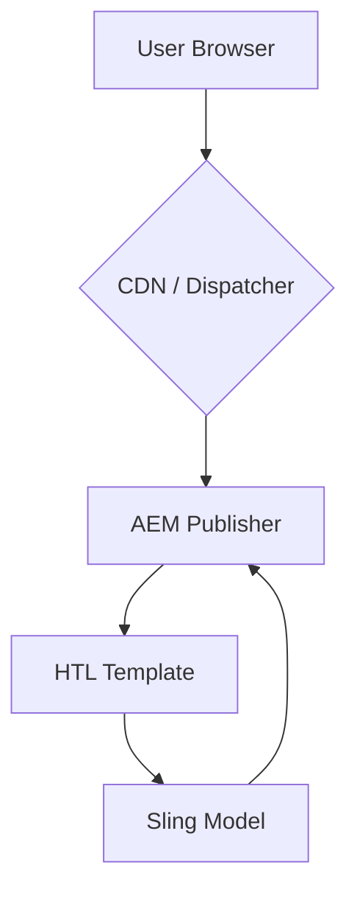

The Voltrux Motors platform utilizes a hybrid headless architecture designed to balance the rich authoring experience of Adobe Experience Manager (AEM) with the performance and flexibility of a modern front-end. This approach ensures that content is both highly manageable for marketing teams and delivered efficiently to end-users.

The data and rendering flow follows a clear, server-side-first pattern, which is optimal for SEO and initial page load speed.

### Flow Breakdown

1.  **User Browser**: The user initiates a request for a page from their web browser.
2.  **CDN / Dispatcher**: The request first hits the caching layer. The Adobe Dispatcher, often fronted by a Content Delivery Network (CDN), serves cached content if available. If not, it forwards the request to the AEM Publish instance.
3.  **AEM Publisher**: The live environment that serves content to end-users. It receives the request and resolves it to a specific AEM page and template.
4.  **HTL Template**: The `*.html` file that defines the structure of the page or component. It contains a mix of standard HTML and Handlebars-like expressions to render dynamic content.
5.  **Sling Model**: The Java business logic layer. The HTL template requests data from its corresponding Sling Model, which encapsulates the logic for fetching and preparing content from the JCR (Java Content Repository). The model then returns the prepared data to the template for rendering.

The final, fully-rendered HTML is then passed back through the chain to the user's browser.
